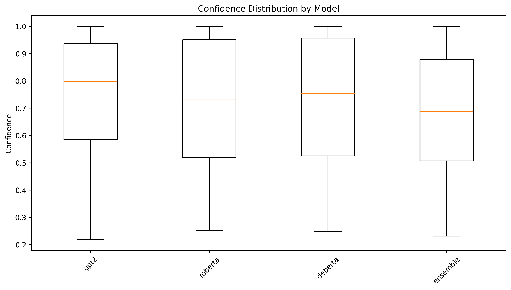
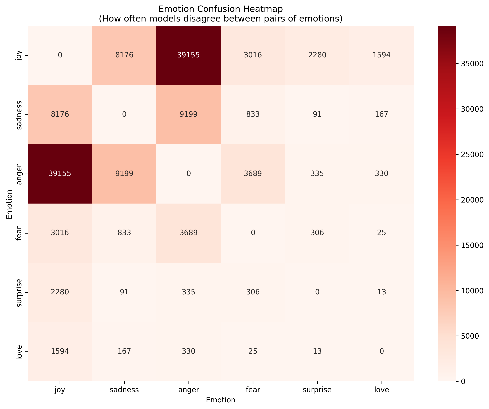
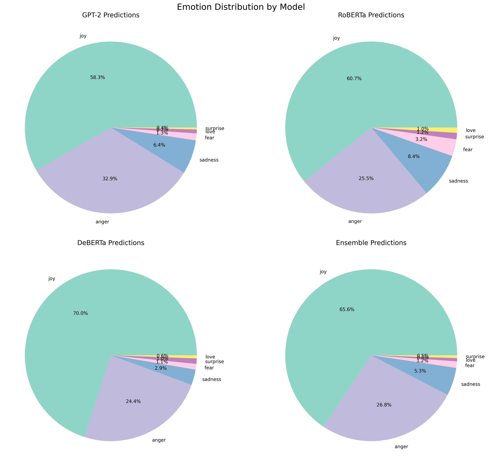
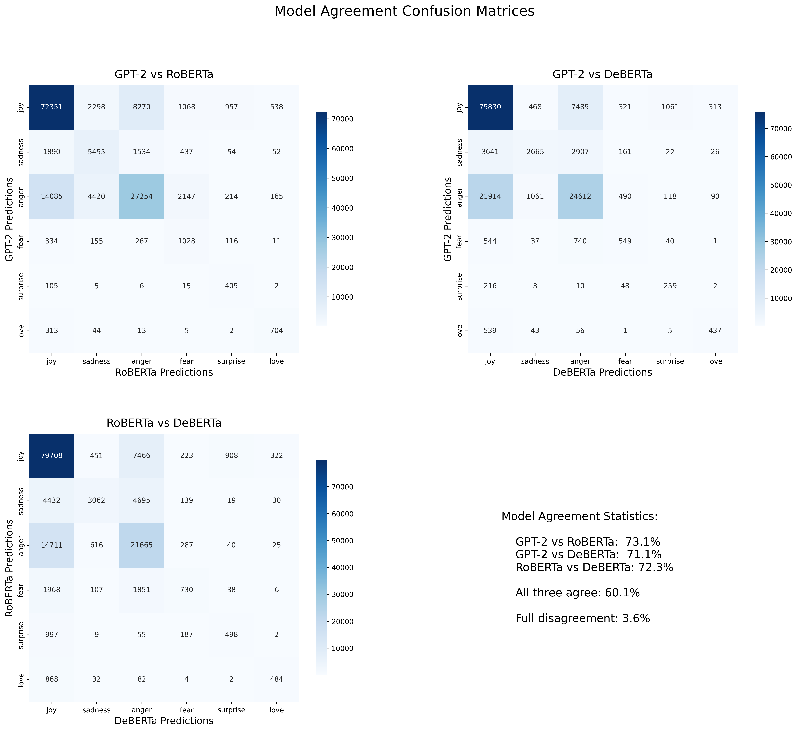
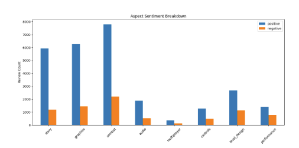

# Steam-Games-Insight-Engine
## Pipeline
#### This is the general workflow of our Steam Games Insight Engine Pipeline:

## Running the Engine
### Web Scraping
#### run `B. WebScraping.py`

### Credibility Detection
#### run `C. Credibility Detection.ipynb`

### Emotion-Based Sentiment Analysis
#### Refer to `README.md` in the Emotion-Based Sentiment Analysis folder.

### Aspect-Based Sentiment Analysis
#### run `D. Faster ABSA_Script.py`

## Output
#### This is the expected output of a complete Steam Games Insight Engine. Let's do a small showcase of BlackMyth: WuKong.

### Emotion-Based Sentiment Analysis

### Aspect-Based Sentiment Analysis

## Models Folder
#### We cannot upalod all our works to GitHub because they are too big!
#### Instead, we upload them into our [shared google folder](https://drive.google.com/drive/folders/16Xz-pwPH2pcVRaaQnqnKR6cqZWzK5F94?usp=sharing).
